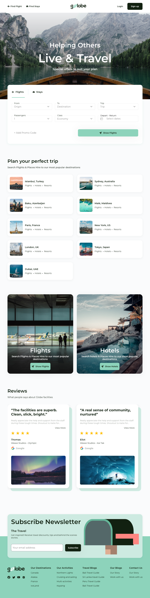

# Travel agency website with React

Welcome to the repository of [Golobe Travel Agency](https://takudzwa30.github.io/globe/), a website that shows flights and hotels for tourists developed with **React**.

To preview please follow this link: [Golobe Travel Agency](https://takudzwa30.github.io/globe/)

<div>
  
</div>

## 📦 Installation

1. Clone this repository:

```bash
git clone https://github.com/Takudzwa30/globe.git

2. Go to the project folder and install dependencies.

```

cd globe
npm install

```

3. Start the application in development mode:

```

npm start

```


🌐 Deployment: Follow the deployment instructions of React.js to deploy your application on the platform of your choice (Vercel, Netlify, etc.).

🙌 Acknowledgments: A big thank you to Figma community for their inspiring website designs and to all the developers who have contributed to the React ecosystem.
```
